# Tutorial

A guided walkthrough — from an empty directory to a tracked, iterating
Azure ML training job — in ten minutes.

---

## 1 · Install

`aj` is distributed on PyPI. Install via [`pipx`](https://pipx.pypa.io/)
so the CLI lives in its own isolated environment:

```bash
sudo apt install pipx          # or: python3 -m pip install --user pipx
pipx ensurepath

pipx install azure_jobs
```

Verify:

```bash
aj --version
```

### Authenticate

`aj` uses the standard Azure credential chain. A one-time `az login` is
enough for most users:

```bash
az login                       # opens a browser
aj auth status                 # check the credential is picked up
```

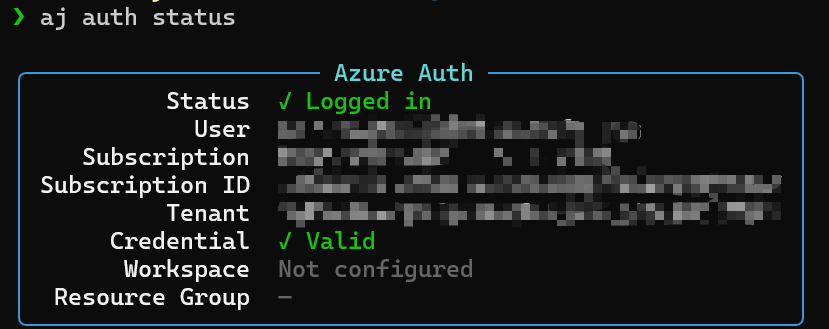

The **Volcano** backend additionally requires `kubectl` configured
against your cluster.

---

## 2 · Author a template

Start from an empty project directory:

```bash
mkdir my-project && cd my-project
```

A template is just YAML. `aj` composes a final job spec by walking the
`base:` chain, so a typical project splits concerns into four kinds of
files under `.azure_jobs/`. Every file has the same outer shape:

```yaml
base: …                        # null, a name, or a list of names
config: …                      # the dict merged into the running result
```

Below is the actual `.azure_jobs/` layout of this repo (`HSPK/azure_jobs`),
trimmed to the relevant files:

```
.azure_jobs/
├── account/
│   └── drl.yaml               # account-level overrides (managed identity)
├── storage/
│   └── default.yaml           # blob mounts
├── environment/
│   ├── base.yaml              # job defaults (sla / priority / env)
│   └── sing.yaml              # Singularity image + setup scripts
└── template/
    ├── base.yaml              # code.local_dir + ignore list
    └── vca100.yaml            # leaf — selected by `-t vca100` at submit time
```

> **Fast path:** prefer guided over manual? Jump to
> [§2.7](#27-fast-path-aj-template-init) and let
> [`aj template init`](commands.md) create all four files for you
> from live Azure data. The walk-through below explains what those
> files actually contain.

### 2.1 · Account — managed identity

Files under `account/` hold account-level overrides. The most common
one is the Singularity managed identity used to mount storage:

```yaml
# .azure_jobs/account/drl.yaml
base:
config:
  jobs:
    - submit_args:
        env:
          _AZUREML_SINGULARITY_JOB_UAI: <YOUR_MANAGED_IDENTITY_UAI>
```

> **`<YOUR_MANAGED_IDENTITY_UAI>`** — full ARM ID of the user-assigned
> managed identity used to mount storage. List the ones you can read with:
>
> ```bash
> aj uai list                              # ARM IDs only (copy-paste ready)
> aj uai list --full                       # name, RG, location, client ID
> ```

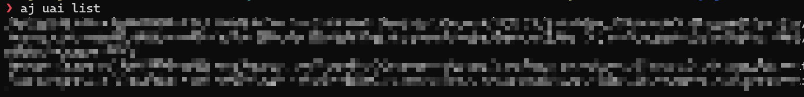

### 2.2 · Storage — blob mounts

Each entry under `storage:` becomes a datastore + mount in the job
container:

```yaml
# .azure_jobs/storage/default.yaml
base:
config:
  storage:
    shared:                               # mount alias, free-form
      storage_account_name: <STORAGE_ACCOUNT>
      container_name: <CONTAINER>
      mount_dir: /mnt/shared
    private:
      storage_account_name: <STORAGE_ACCOUNT>
      container_name: <CONTAINER>
      mount_dir: /mnt/private
```

> **`<STORAGE_ACCOUNT>` / `<CONTAINER>`** — list datastores already
> registered in your workspace (these are the storage accounts AML can
> see):
>
> ```bash
> aj ds list                               # name, account, container
> aj ds show <name>                        # full details for one
> ```
>
> To discover other storage accounts in your subscriptions:
>
> ```bash
> aj sa list                               # name, RG, location, kind, SKU
> ```
>
> **`mount_dir`** — any path inside the job container; you choose it.

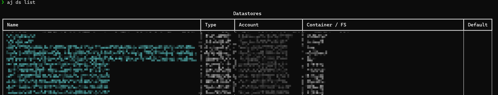

### 2.3 · Environment — image, setup, job defaults

Split into a generic `base.yaml` and the Singularity-specific overlay:

```yaml
# .azure_jobs/environment/base.yaml
base:
config:
  jobs:
    - identity: managed
      sla_tier: Premium
      priority: high
      process_count_per_node: 1
      submit_args:
        env:
          AMLT_DIRSYNC_MOVE: true
          SHARED_MEMORY_PERCENT: 0.9
          NCCL_TIMEOUT: 6000000
          NCCL_DEBUG: ERROR
          TORCH_NCCL_BLOCKING_WAIT: 1
        container_args:
          shm_size: 2048g
```

```yaml
# .azure_jobs/environment/sing.yaml
base: base                              # inherits environment/base.yaml
config:
  target:
    service: sing
  environment:
    image: <REGISTRY>/<IMAGE>:<TAG>
    setup:
      - bash ./.azure_jobs/scripts/install.sh
  jobs:
    - submit_args:
        container_args:
          user: root
```

> **`<REGISTRY>/<IMAGE>:<TAG>`** — for Singularity, list the curated
> base images:
>
> ```bash
> aj image list                            # all curated amlt-sing/* images
> ```

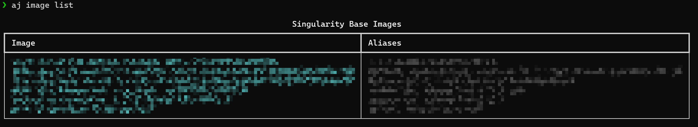

### 2.4 · Template base — code upload rules

A second `base.yaml` lives **inside `template/`** and is what leaves
inherit via `base: base` (plain name → same directory). It holds the
project-wide code upload settings:

```yaml
# .azure_jobs/template/base.yaml
config:
  code:
    local_dir: "$CONFIG_DIR/../../"     # repo root, two levels above .azure_jobs/
    ignore:
      - "runs/"
      - "log/"
      - "wandb/"
      - "output"
      - "checkpoints/"
      - ".git/"
      - "__pycache__/"
```

### 2.5 · Leaf — what you actually submit

This is the one file selected by `-t vca100`. It picks the VC, points
at a workspace, and resolves the SKU at submit-time from `{nodes}` /
`{processes}`:

```yaml
# .azure_jobs/template/vca100.yaml
base:
  - base                                # template/base.yaml (code rules)
  - account.drl                         # account/drl.yaml    (sing UAI)
  - storage.default                     # storage/default.yaml (mounts)
  - environment.sing                    # environment/sing.yaml + base.yaml
config:
  target:
    name: <VC_NAME>                     # Singularity virtual cluster
    workspace_name: <WORKSPACE>
  _extra:
    processes: 1
  jobs:
    - sku: "{nodes}x40G{processes}-A100"
```

> **`<VC_NAME>` / `sku`** — list the VCs you can submit to and the
> SKUs available on each:
>
> ```bash
> aj quota list                            # Singularity VCs + remaining quota
> aj sku list                              # SKU strings per VC family
> ```
>
> In the SKU string, `{nodes}` / `{processes}` are filled in from
> `-n` / `-p` at submit time.
>
> ```bash
> aj ws show                               # currently active workspace
> aj ws list                               # all workspaces in current sub
> ```

### Inspect what you wrote

```bash
aj template list                        # all leaves
aj template show vca100                 # resolved config, post-inheritance
aj template validate                    # schema sweep across all templates
```

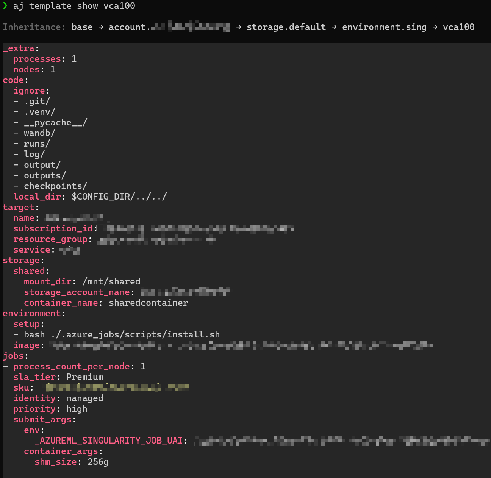

### 2.6 · Share via a private GitHub repo

Push the `.azure_jobs/` tree to a GitHub repo so the rest of your team
can `aj pull <user>/<repo>`. Use a **private** repo if any value in
`account/` or `storage/` is sensitive.

**One-time, on GitHub** — create an empty private repo, e.g.
`my-org/aj-templates`.

**One-time, on your machine** — make sure SSH auth works, since `aj
pull` / `aj template push` shell out to `git`:

```bash
ssh-keygen -t ed25519 -C "you@example.com"
# add ~/.ssh/id_ed25519.pub to GitHub → Settings → SSH and GPG keys
ssh -T git@github.com                   # verify
```

**First push** — tell `aj` which remote owns these templates, then push:

```bash
aj pull my-org/aj-templates             # register the remote (empty repo OK)
aj template push -m "initial templates" # mirror .azure_jobs/ → remote
```

**Teammate onboarding** — anyone with read access can now bootstrap
against the same templates:

```bash
mkdir my-project && cd my-project
aj init                                 # → my-org/aj-templates
```

> `aj template push` clones the remote into a temp dir, mirrors your
> local `.azure_jobs/` over it (skipping `record.jsonl` and
> `aj_config.json`), commits, and pushes. Run `aj template diff` first
> to preview what will change.

### 2.7 · Fast path — `aj template init`

§2.1–§2.5 walked you through writing each file by hand so you understand
the moving parts. For every leaf after the first, let the wizard pick
everything from live Azure data:

```bash
aj template init
```

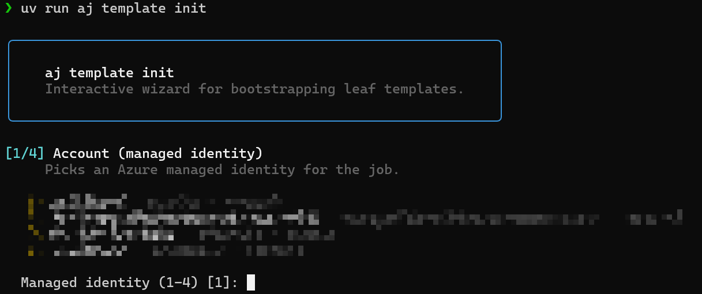

It walks through four shared picks and then auto-generates one leaf per
(VC, accelerator, GPU memory) combination with positive user quota:

| Step | What you pick |
|------|---------------|
| 1 · Account | A managed identity (from `aj uai list`) |
| 2 · Environment | A Singularity image (from `aj image list`) |
| 3 · Storage | Storage account + container + mount path |
| 4 · Workspace | The Azure ML workspace that owns these leaves' runs |

Leaves are then written to
`.azure_jobs/template/{vc}_{accelerator}_{memory}.yaml` — one per
quota slice visible to your account. Pass `-f` to overwrite existing
files.

---

## 3 · A runnable demo

A leaf points at code that lives outside `.azure_jobs/`. Here is the
minimum project you need at the repo root for `aj run -t vca100
train.py` to actually do something:

```
my-project/
├── .azure_jobs/
│   └── scripts/
│       └── install.sh       # one-time setup, baked by `environment.setup`
├── pyproject.toml           # so `uv run train.py` resolves dependencies
└── train.py                 # entrypoint
```

**`.azure_jobs/scripts/install.sh`** — runs once per container at job
start (referenced by `environment/sing.yaml` → `environment.setup`):

```bash
#!/usr/bin/env bash
set -eo pipefail

# Make uv available so `uv run train.py` works on every node.
curl -LsSf https://astral.sh/uv/install.sh | sh
$SUDO cp $HOME/.local/bin/uv  /usr/local/bin
$SUDO cp $HOME/.local/bin/uvx /usr/local/bin
uv python install 3.10
```

> `$SUDO` is set by the container (empty when already root). The image
> picked in §2.3 already has CUDA / cuDNN / NCCL — `install.sh` only
> needs whatever your project adds on top.

**`pyproject.toml`** — `aj run train.py` shells out to `uv run`, so a
minimal PEP 621 file is enough:

```toml
[project]
name = "my-project"
version = "0.0.1"
requires-python = ">=3.10"
dependencies = [
  "torch>=2.4",
]
```

**`train.py`** — a tiny CUDA-aware smoke test using the runtime
contract from §6:

```python
import os, socket, torch

nodes = int(os.environ["AJ_NODES"])
gpus  = int(os.environ["AJ_GPUS_PER_NODE"])
rank  = int(os.environ.get("RANK", "0"))

print(f"[{socket.gethostname()}] rank={rank} "
      f"nodes={nodes} gpus_per_node={gpus} "
      f"cuda={torch.cuda.is_available()} "
      f"devices={torch.cuda.device_count()}")

for i in range(torch.cuda.device_count()):
    x = torch.randn(4096, 4096, device=f"cuda:{i}")
    (x @ x).sum().item()
print("ok")
```

---

## 4 · Dry-run before you spend

```bash
aj run -t vca100 -d -n 1 -p 1 train.py
```

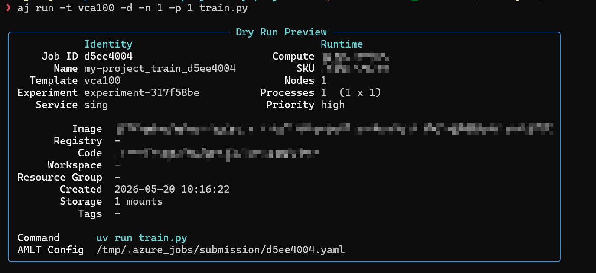

`-d` renders the full submission YAML to `.azure_jobs/dryrun/<sid>.yaml`
without uploading or submitting. Always do this after touching a
template.

Curious what gets uploaded?

```bash
aj code stats          # file count, total size, content hash
aj code stats -n 20    # 20 largest files
```

> A `.codeignore` (or `.amltignore`) at the project root prunes the
> upload. `.git`, `__pycache__`, `.venv`, `node_modules`, and
> `.azure_jobs/` (except `scripts/`) are always excluded.

---

## 5 · Pre-flight

Catch quota issues before submitting:

```bash
aj quota list                 # Singularity VC quota
aj quota list --aml           # AML cluster availability
```

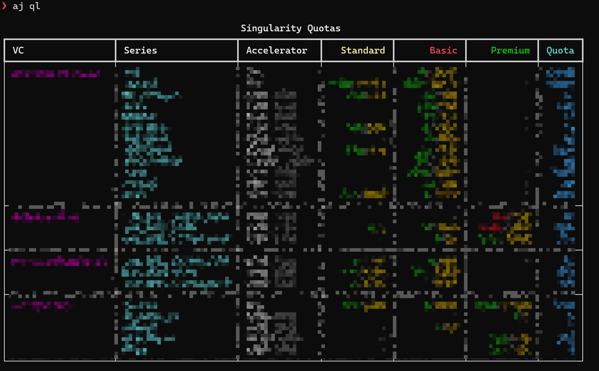

---

## 6 · Submit

```bash
aj run -t vca100 -n 2 -p 8 train.py --lr 1e-3
```

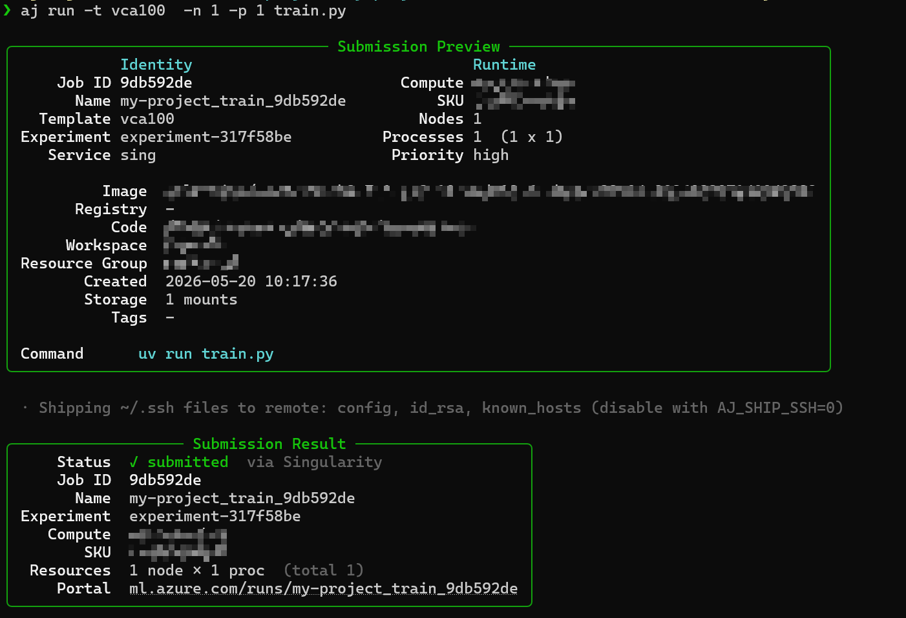

| Flag    | Meaning                                                   |
|---------|-----------------------------------------------------------|
| `-t`    | Template (omit to reuse the last default)                 |
| `-n`    | Nodes                                                     |
| `-p`    | GPUs per node — drives SKU + `AJ_GPUS_PER_NODE`           |
| `--ppn` | Launcher processes per node (e.g. `torchrun --nproc-per-node`) |
| `-d`    | Dry run                                                   |
| `--amlt`| Submit via the `amlt` CLI instead of native REST          |

Anything after the script forwards verbatim to your command. `.py` runs
via `uv run`, `.sh` via `bash`.

Every submission is appended to `.azure_jobs/record.jsonl` with a short
ID (`AJ_ID`) for later lookup.

### Inside your training script

```python
import os
nodes = int(os.environ["AJ_NODES"])
gpus = int(os.environ["AJ_GPUS_PER_NODE"])
run_id = os.environ["AJ_ID"]
```

```bash
torchrun --nnodes $AJ_NODES --nproc-per-node $AJ_GPUS_PER_NODE train.py
```

Full env contract: [env_vars.md](env_vars.md).

---

## 7 · Track

```bash
aj list                       # local submission history
aj job list                   # cloud jobs in the current workspace
aj job list -s Running
aj job show <id>              # detail panel (short ID works)
aj job logs <id>              # stream + download
aj job cancel <id>
aj job stats                  # GPU-hours · success rate · breakdowns
```

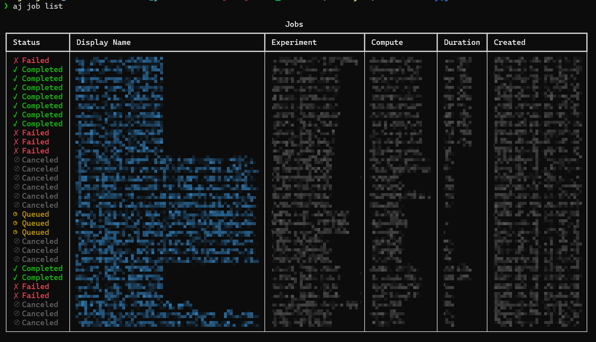

For interactive triage:

```bash
aj dash                       # TUI dashboard
```

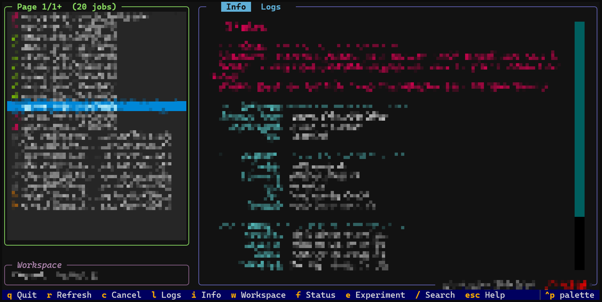

---

## 8 · Where to go next

| Topic | Doc |
|-------|-----|
| Full CLI reference (every command + flag) | [commands.md](commands.md) |
| Template syntax · `base:` resolution · merge rules · SKU patterns | [configuration.md](configuration.md) |
| `AJ_*` runtime contract + client-side flags | [env_vars.md](env_vars.md) |
| Embed `aj` in Python | [sdk.md](sdk.md) |
| How submission, merging, and upload actually work | [architecture.md](architecture.md) |

For automation, pass `--json` to any command — every command emits one
envelope with a `kind=…` discriminator, safe to pipe into `jq`.
